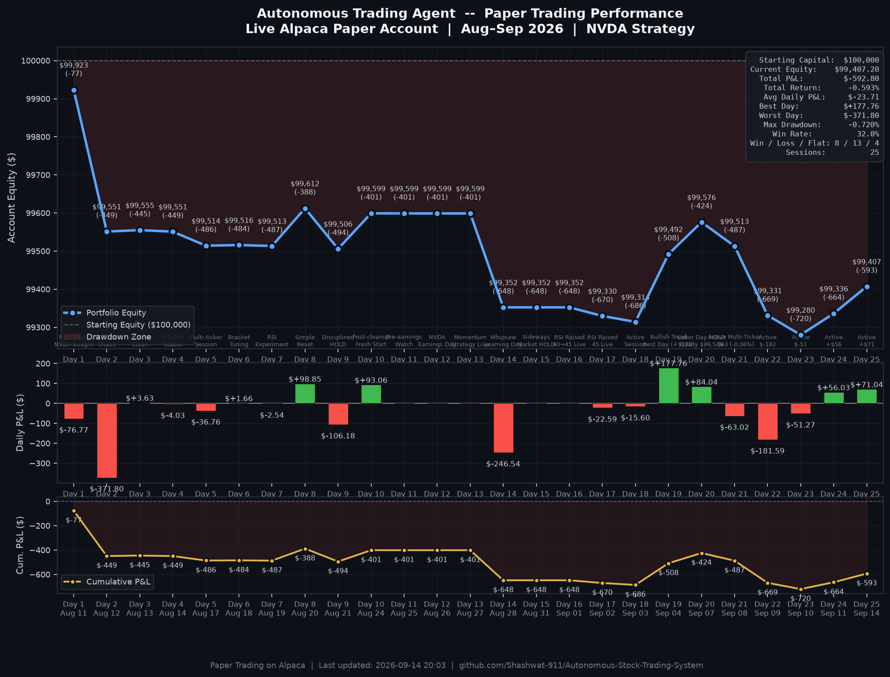
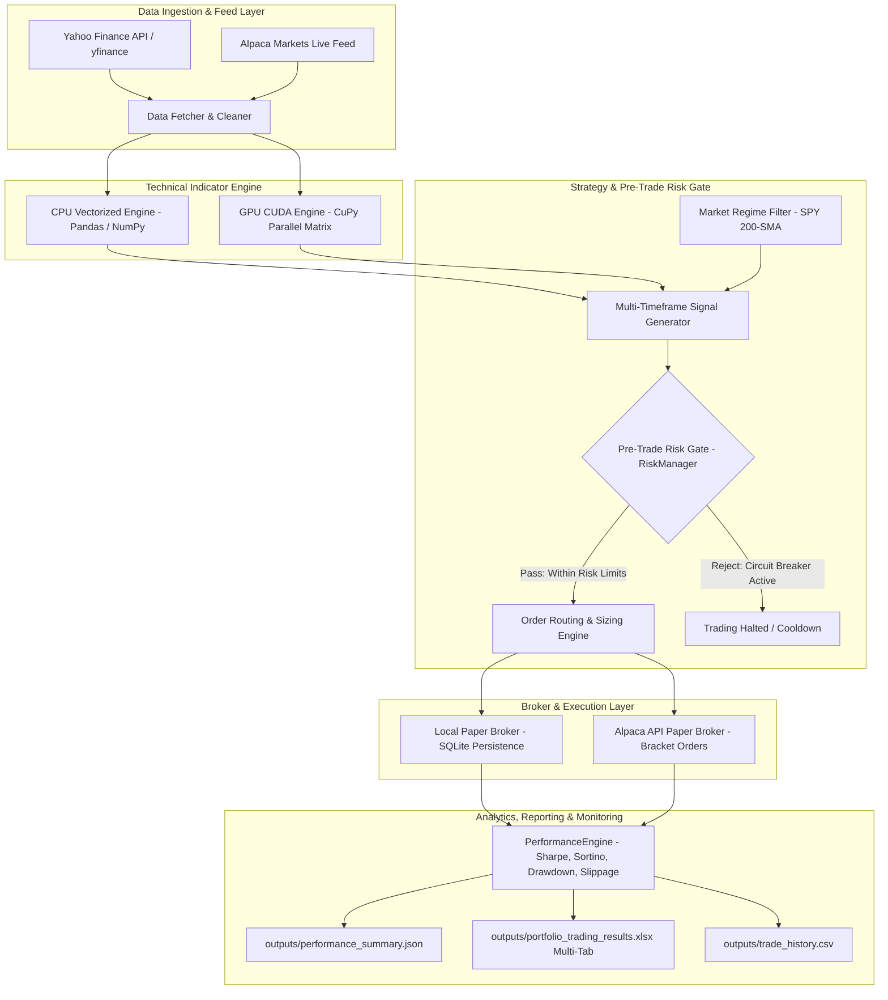

# Autonomous Stock Trading & Quantitative Backtesting System

[](https://www.python.org/downloads/)
[](https://alpaca.markets/)
[](https://cupy.dev/)
[](https://opensource.org/licenses/MIT)

An autonomous, production-grade algorithmic trading system and quantitative research framework built in Python. Designed for automated multi-asset equity trading, the system combines multi-timeframe technical indicator analysis, GPU-accelerated batch computations, dynamic ATR risk sizing, multi-tier circuit breakers, automated bracket order management (take-profit, stop-loss, and trailing stops), rolling walk-forward backtesting, and institutional-style quantitative performance metrics.

---

## Table of Contents

- [Live Paper Trading Performance](#live-paper-trading-performance)
- [System Architecture](#system-architecture)
- [Key Features](#key-features)
- [Quantitative Strategy & Signal Engine](#quantitative-strategy--signal-engine)
- [Risk Management & Circuit Breakers](#risk-management--circuit-breakers)
- [Execution Layer](#execution-layer)
- [Performance Analytics & Metrics](#performance-analytics--metrics)
- [Walk-Forward Validation](#walk-forward-validation)
- [Project Directory Structure](#project-directory-structure)
- [Installation & Setup](#installation--setup)
- [Configuration Reference](#configuration-reference)
- [Usage & Execution Modes](#usage--execution-modes)
- [Outputs & Reporting](#outputs--reporting)
- [Disclaimer](#disclaimer)

---

## Live Paper Trading Performance

> **Paper Trading on Alpaca** | Started: Aug 11, 2026 | Initial Capital: $100,000.00 | Universe: NVDA (Daily / 5m)



*Chart auto-generated from live Alpaca Portfolio History API and verified session telemetry via [`scripts/generate_pnl_chart.py`](scripts/generate_pnl_chart.py).*

### Daily Session Breakdown

| Session | Date | Ending Equity | Daily P&L | Cumulative P&L | Return (%) | Status |
|---|---|---|---|---|---|---|
| **Day 1** | Aug 11 (Tue) | $99,923.23 | -$76.77 | -$76.77 | -0.077% | First Trade — NVDA Bought |
| **Day 2** | Aug 12 (Wed) | $99,551.43 | -$371.80 | -$448.57 | -0.449% | 100-Ticker Chaos |
| **Day 3** | Aug 13 (Thu) | $99,555.06 | +$3.63 | -$444.94 | -0.445% | Rebuilt Clean |
| **Day 4** | Aug 14 (Fri) | $99,551.03 | -$4.03 | -$448.97 | -0.449% | 5-Ticker Stable |
| **Day 5** | Aug 17 (Mon) | $99,514.27 | -$36.76 | -$485.73 | -0.486% | Multi-ticker Session |
| **Day 6** | Aug 18 (Tue) | $99,515.93 | +$1.66 | -$484.07 | -0.484% | Bracket Tuning |
| **Day 7** | Aug 19 (Wed) | $99,513.39 | -$2.54 | -$486.61 | -0.487% | RSI Experiment |
| **Day 8** | Aug 20 (Thu) | $99,612.24 | **+$98.85** | -$387.76 | -0.388% | **Simple Reset — Profitable** |
| **Day 9** | Aug 21 (Fri) | $99,506.06 | -$106.18 | -$493.94 | -0.494% | Disciplined HOLD |
| **Day 10** | Aug 24 (Mon) | $99,599.12 | **+$93.06** | -$400.88 | -0.401% | **Post-cleanup Fresh Start — Profitable** |
| **Day 11** | Aug 25 (Tue) | $99,598.94 | -$0.18 | -$401.06 | -0.401% | Pre-earnings Watch |
| **Day 12** | Aug 26 (Wed) | $99,598.94 | $0.00 | -$401.06 | -0.401% | NVDA Earnings — Disciplined HOLD |
| **Day 13** | Aug 27 (Thu) | $99,598.94 | $0.00 | -$401.06 | 0.000% | Momentum Strategy — First Live Session |
| **Day 14** | Aug 28 (Fri) | $99,352.83 | **-$246.11** | -$647.17 | -0.647% | Momentum Whipsaw — Hold Filter Added |
| **Day 15** | Aug 31 (Mon) | $99,352.40 | $0.00 | -$647.17 | -0.647% | Sideways Market — Disciplined HOLD |
| **Day 16** | Sep 1 (Tue) | $99,330.04 | **-$22.36** | -$669.96 | -0.670% | NVDA Dip — 1 Round-Trip; Hold Filter Works |

> **Current Equity**: $99,330.04 | **Total P&L**: -$669.96 | **Best Day**: +$98.85 (Day 8) | **Win Rate**: 25.0% (4W / 9L / 3 Flat) | **Max Drawdown**: -0.670% | **Sessions**: 16


---

## System Architecture



---

## Key Features

- **Multi-Timeframe Signal Analysis**: Blends intraday price bars (5m/1h) with daily trend filters and broad-market regime filters (SPY 200-day Simple Moving Average).
- **GPU-Accelerated Indicator Engine**: Computes technical indicators across multi-ticker matrices concurrently using NVIDIA CUDA via CuPy, with automatic CPU NumPy/Pandas fallback.
- **Dynamic ATR Position Sizing**: Automatically adjusts position size per trade based on current asset volatility (Average True Range), equity percentage limits, and absolute dollar caps.
- **Institutional Pre-Trade Risk Management**:
  - Daily portfolio loss circuit breaker (e.g., maximum 5% daily drawdown).
  - Per-trade stop-loss triggers with automated cooldown timers (e.g., 15–30 minutes).
  - Portfolio heat limit (e.g., maximum 60% total long equity exposure).
- **Automated Bracket & Trailing Orders**: Employs Alpaca bracket orders with ATR-calibrated stop-loss and take-profit targets (2:1 reward-to-risk ratio) and dynamic trailing stop escalation.
- **Walk-Forward Validation Engine**: Evaluates out-of-sample performance over rolling train/test windows (e.g., 6 months train, 3 months test) to eliminate look-ahead bias and curve-fitting.
- **Institutional Analytics Engine**: Computes annualized Sharpe ratio, Sortino ratio, max drawdown and duration, win rate, trade expectancy, profit factor, execution latency (ms), and fill slippage (%).
- **Multi-Tab Excel Dashboard Exporter**: Live-generates `portfolio_trading_results.xlsx` featuring a master portfolio overview tab and individual ticker log sheets.

---

## Quantitative Strategy & Signal Engine

The trading engine evaluates technical indicators across price windows using rigorous mathematical formulations:

### 1. Indicators Calculated
- **Simple Moving Average (SMA)**: Rolling arithmetic mean over $n$ periods (default $n=20$ and $n=200$).
- **Exponential Moving Average (EMA)**: Exponentially weighted moving average with smoothing factor $\alpha = \frac{2}{n + 1}$.
- **Relative Strength Index (RSI)**: Calculated using **Wilder's exponential smoothing method** over 14 periods:
  $$\text{RSI} = 100 - \left(\frac{100}{1 + \frac{\text{EMA}(\text{Gain}, 14)}{\text{EMA}(\text{Loss}, 14)}}\right)$$
- **Moving Average Convergence Divergence (MACD)**: Fast EMA (12) minus Slow EMA (26), evaluated against a 9-period Signal EMA line and Histogram.
- **Bollinger Bands**: 20-period baseline with $\pm 2.0$ rolling standard deviations.
- **Average True Range (ATR)**: 14-period smoothed true range reflecting actual market volatility:
  $$\text{TR} = \max\Big(\text{High} - \text{Low}, |\text{High} - \text{Close}_{\text{prev}}|, |\text{Low} - \text{Close}_{\text{prev}}|\Big)$$

### 2. Signal Generation Matrix (Dual-Path Entry)

| Signal | Conditions Evaluated | Confirmation / Weight |
|---|---|---|
| **BUY (Path 1: Dip Entry)** | 1. RSI oversold ($< 45.0$)<br>2. MACD Bullish ($\text{MACD} > \text{Signal}$)<br>3. Price above 20-period SMA ($\text{Close} > \text{SMA}_{20}$)<br>4. Price above lower Bollinger Band ($\text{Close} > \text{BB}_{\text{Lower}}$) | Requires $\ge 75\%$ confidence (3 of 4 conditions met) + SPY above 200-SMA |
| **BUY (Path 2: Momentum)** | 1. MACD Bullish Crossover ($\text{MACD}_{\text{now}} > \text{Signal}_{\text{now}}$ and $\text{MACD}_{\text{prev}} \le \text{Signal}_{\text{prev}}$)<br>2. Price above 20-period SMA ($\text{Close} > \text{SMA}_{20}$)<br>3. RSI between 45.0 and 65.0 | High-conviction momentum entry (catches post-earnings pumps) + SPY above 200-SMA |
| **SELL** | 1. RSI overbought ($> 70.0$)<br>2. MACD Bearish crossover ($\text{MACD} < \text{Signal}$)<br>3. Price breaks below lower Bollinger Band ($\text{Close} < \text{BB}_{\text{Lower}}$)<br>4. Risk manager circuit breaker or stop-loss trigger ($-4.0\%$) | Liquidates open position immediately |
| **HOLD** | Insufficient confirmation or risk blocks active | No action |

### Strategy Evolution Log

| Phase | Dates | Change | Reason |
|---|---|---|---|
| Week 1 | Aug 11–15 | RSI dip-buying, strict (RSI < 30, all 4 confirm) | Baseline validation |
| Week 2 | Aug 18–26 | Simplified + cleanup, require_confirmation=False | Too strict, 0 clean trades |
| Week 3 (Aug 27) | Aug 27–28 | Dual-path: Dip + MACD Momentum crossover | Catch post-earnings moves |
| Week 3 (Aug 28) | Aug 28 | Position size $2k → $5k | Returns too small |
| Week 4 | Sep 1+ | 60-min minimum hold filter added | Whipsaw on Aug 28 caused 2 losing trades in 30 mins |

> Every change above was driven by real live trading data, 
> not theory. Whipsaw behavior detected Aug 28 — 
> momentum crossover on daily candles is unstable at 
> 15-minute scan intervals without a minimum hold period.

---

## Risk Management & Circuit Breakers

The system enforces strict pre-trade rules via the `RiskManager` module:

### Dynamic ATR Position Sizing Formula
$$\text{Shares} = \left\lfloor \frac{\text{Equity} \times \text{RiskPctPerTrade}}{\text{ATR} \times k} \right\rfloor$$
*Capped by:* $\min(\text{MaxPositionDollars}, \text{Equity} \times \text{MaxPositionPct})$

### Risk Controls Summary
- **Daily Loss Circuit Breaker**: If total portfolio equity drops by more than `max_daily_loss_pct` (e.g., 5%) from the start-of-day balance, all trading is halted for the rest of the day.
- **Per-Trade Stop-Loss & Cooldown**: If an open trade drops below `max_trade_loss_pct` (e.g., 4%), the position is liquidated and a cooldown timer (e.g., 15 minutes) prevents immediate re-entry.
- **Portfolio Heat Filter**: Total market value of all long positions cannot exceed `max_portfolio_heat_pct` (e.g., 60% of equity).
- **Market Regime Gate**: If the benchmark ETF (SPY) trades below its 200-day moving average, all BUY signals are blocked.

---

## Execution Layer

### 1. Live Alpaca Paper Broker (`broker/alpaca.py`)
- Official integration with `alpaca-py`.
- Submits **Bracket Orders** combining Entry, Take-Profit ($+3.0 \times \text{ATR}$), and Stop-Loss ($-1.5 \times \text{ATR}$).
- Implements trailing stop-loss management once the asset achieves $+1.5 \times \text{ATR}$ gain.
- Verifies market clock status and tracks live buying power, cash, equity, and order fills.

### 2. Local Paper Broker (`broker/paper.py`)
- Self-contained, zero-dependency paper broker.
- Persists all executions, timestamps, prices, quantities, cash balances, and realized PnL in a local SQLite database (`trades.db`).
- Supports in-memory simulation (`:memory:`) for rapid backtesting.

---

## Performance Analytics & Metrics

The `PerformanceEngine` in `analytics/metrics.py` evaluates trading performance across both trade histories and equity curves:

| Metric | Formula / Description |
|---|---|
| **Sharpe Ratio** | Annualized risk-adjusted return relative to risk-free rate ($R_f = 4\%$):<br>$$\text{Sharpe} = \frac{\bar{R} - R_f}{\sigma_R} \times \sqrt{252}$$ |
| **Sortino Ratio** | Annualized return penalizing downside deviation only:<br>$$\text{Sortino} = \frac{\bar{R} - R_f}{\sigma_{\text{downside}}} \times \sqrt{252}$$ |
| **Max Drawdown (MDD)** | Peak-to-trough maximum percentage drop of the equity curve along with consecutive duration periods. |
| **Expectancy ($E$)** | Average dollar expected per trade:<br>$$E = (\text{WinRate} \times \text{AvgGain}) - ((1 - \text{WinRate}) \times |\text{AvgLoss}|)$$ |
| **Profit Factor** | Ratio of gross profits to gross losses: $\frac{\sum \text{Gains}}{\sum |\text{Losses}|}$. |
| **Order Slippage (%)** | Difference between signal price and filled average price: $\left|\frac{\text{FillPrice} - \text{SignalPrice}}{\text{SignalPrice}}\right| \times 100$. |
| **Execution Latency (ms)** | Time elapsed between order submission and order fill confirmation in milliseconds. |

---

## Walk-Forward Validation

To prevent statistical overfitting and curve-fitting, the `WalkForwardBacktester` (`backtest/walk_forward.py`) implements a rolling walk-forward framework:

```
Full History: [============================================================]
Window 1:     [--- Train (6mo) ---][ Test (3mo) ]
Window 2:             [--- Train (6mo) ---][ Test (3mo) ]
Window 3:                     [--- Train (6mo) ---][ Test (3mo) ]
```

- Each test window is preceded by a warmup period to prime indicator states.
- Generates a **Consistency Score** (% of profitable out-of-sample windows), average return per window, best/worst window returns, and worst-case drawdown.

---

## Project Directory Structure

```
Autonomous-Stock-Trading-System/
├── analytics/
│   ├── __init__.py
│   └── metrics.py                  # Quantitative performance engine (Sharpe, Sortino, MDD, Expectancy)
├── backtest/
│   ├── __init__.py
│   └── walk_forward.py             # Rolling walk-forward backtesting framework
├── broker/
│   ├── __init__.py
│   ├── alpaca.py                   # Live Alpaca Markets paper broker (bracket orders, clock, positions)
│   └── paper.py                    # Local paper broker with SQLite persistence
├── data/
│   ├── __init__.py
│   ├── excel_exporter.py           # Multi-tab Excel workbook generator (openpyxl)
│   └── fetcher.py                  # Robust market data fetcher with exponential backoff retries
├── outputs/
│   ├── alpaca_equity_history.csv   # Historical daily equity and P&L dataset from Alpaca API
│   ├── backtest_results.csv        # Historical backtest trade records
│   ├── daily_pnl_chart.png         # Dual-panel daily P&L equity curve and bar chart
│   ├── logs/                       # Date-stamped live session log archives
│   ├── paper_results.csv           # Local paper trading trade records
│   ├── performance_summary.json    # JSON report of quantitative performance metrics
│   ├── portfolio_trading_results.xlsx # Multi-tab Excel workbook (master summary + ticker sheets)
│   ├── project_status.py           # Quick CLI status overview & diagnostic tool
│   ├── session_all_orders.csv      # Detailed log of all Alpaca orders
│   ├── trade_history.csv           # Aggregate session metrics
│   └── walkforward_results.csv     # Per-window walk-forward validation results
├── risk/
│   ├── __init__.py
│   └── manager.py                  # Pre-trade circuit breaker, ATR position sizing, cooldowns
├── scripts/
│   ├── cleanup_positions.py        # Utility to cancel pending orders and liquidate non-monitored tickers
│   ├── diag_orders.py              # Diagnostic inspector for order legs (TP/SL) and fills
│   ├── fetch_alpaca_equity.py      # Direct Alpaca Portfolio History API fetcher
│   ├── generate_pnl_chart.py       # High-resolution dark-mode daily P&L chart generator
│   ├── generate_session_report.py  # Generates end-of-session performance summary from Alpaca
│   ├── run_live_logger.py          # Process wrapper for background live logging
│   └── session_analysis.py         # Multi-session trend assessment and ASCII equity curve
├── strategy/
│   ├── __init__.py
│   ├── gpu_indicators.py           # CUDA CuPy-accelerated technical indicator matrix engine
│   ├── indicators.py               # Vectorized indicator calculations (SMA, EMA, RSI, MACD, BB, ATR)
│   └── signals.py                  # Multi-indicator signal generator with risk gating
├── .env.example                    # Environment variable configuration template
├── .gitignore                      # Git ignore patterns
├── config.py                       # Centralized configuration source of truth
├── main.py                         # Master entry point CLI
├── README.md                       # Comprehensive system documentation
└── requirements.txt                # Python package dependencies
```

---

## Installation & Setup

### 1. Prerequisites
- Python **3.10+** (Python 3.11 or 3.12 recommended)
- Git
- (Optional) NVIDIA GPU with CUDA Toolkit installed if using GPU indicator acceleration.

### 2. Clone the Repository
```bash
git clone https://github.com/Shashwat-911/Autonomous-Stock-Trading-System.git
cd Autonomous-Stock-Trading-System
```

### 3. Create and Activate a Virtual Environment
- **Windows (PowerShell):**
  ```powershell
  python -m venv venv
  .\venv\Scripts\Activate.ps1
  ```
- **macOS / Linux:**
  ```bash
  python3 -m venv venv
  source venv/bin/activate
  ```

### 4. Install Dependencies
```bash
pip install -r requirements.txt
```

*(Optional GPU Support)* If you have an NVIDIA GPU and CUDA 12.x installed:
```bash
pip install cupy-cuda12x
```

### 5. Configure API Credentials
Create a `.env` file in the root directory (or copy from `.env.example`):
```bash
cp .env.example .env
```
Edit `.env` with your Alpaca Paper Trading API keys:
```ini
ALPACA_API_KEY=your_alpaca_api_key_here
ALPACA_SECRET_KEY=your_alpaca_secret_key_here
ALPACA_BASE_URL=https://paper-api.alpaca.markets
ALPACA_FEED=iex
```

---

## Configuration Reference

All settings can be customized in `config.py`:

```python
# Trading & Universe Settings
TRADING = {
    "ticker": "NVDA",                                  # Primary asset
    "tickers": ["NVDA", "AAPL", "MSFT", "GOOGL", "AMZN"], # Multi-ticker universe
    "interval": "1h",                                  # Bar interval for live monitoring
    "interval_daily": "1d",                            # Daily bar interval for multi-timeframe check
    "initial_balance": 100000.0,                       # Starting capital ($)
    "min_confidence": 0.75,                            # Minimum confidence score for BUY execution
    "lookback_days": 60,                               # Historical lookback (days)
    "lookback_days_intraday": 30,                      # 5-minute lookback (days)
}

# Signal Parameters
SIGNAL = {
    "rsi_oversold": 45.0,                              # RSI threshold for oversold dip entry
    "rsi_overbought": 65.0,                            # RSI threshold for overbought exit
    "require_confirmation": False,                     # Requires >= 75% indicator consensus
}

# Pre-Trade Risk Limits
RISK = {
    "max_daily_loss_pct": 0.05,                        # 5% max portfolio daily drawdown
    "max_trade_loss_pct": 0.04,                        # 4% per-trade stop-loss
    "max_position_pct": 0.05,                          # 5% max portfolio allocation per asset
    "max_position_dollars": 2000.0,                    # $2,000 hard dollar cap per position
    "cooldown_minutes": 15,                            # Cooldown after stop-loss event
    "max_portfolio_heat_pct": 0.60,                    # Max 60% of equity in long positions
    "atr_period": 14,                                  # ATR smoothing window
    "atr_multiplier_k": 2.0,                           # ATR sizing divisor
    "risk_pct_per_trade": 0.01,                        # Risk 1% of total equity per trade
}

# Bracket Order Configuration
BRACKET = {
    "stop_loss_atr_mult": 1.5,                         # Stop-loss at entry - 1.5×ATR
    "take_profit_atr_mult": 3.0,                       # Take-profit at entry + 3.0×ATR (2:1 R:R)
    "trailing_activation_atr": 1.5,                    # Activate trailing stop after +1.5×ATR gain
    "trailing_stop_atr_mult": 1.0,                     # Trailing stop distance once active
}

# Broad Market Regime Filter
MARKET_REGIME = {
    "ticker": "SPY",                                   # Market benchmark
    "sma_period": 200,                                 # 200-day simple moving average
}
```

---

## Usage & Execution Modes

The master entry point is `main.py`. Choose from several execution modes:

### 1. Historical Backtest Mode
Simulates the strategy over a historical date range and outputs full trade logs and summary metrics:
```bash
python main.py backtest
```

### 2. Walk-Forward Backtest Mode
Runs rolling walk-forward out-of-sample validation to measure strategy consistency:
```bash
python main.py walkforward
```

### 3. Local Paper Trading Mode
Runs a local, self-contained real-time paper trading loop with SQLite trade recording:
```bash
python main.py paper
```

### 4. Live Alpaca Paper Trading Mode
Connects directly to your Alpaca paper account to execute real-time multi-ticker scans, submit bracket orders, and manage positions:
```bash
python main.py live
```

### 5. View Logs & Diagnostics
Inspect recent execution logs:
```bash
python main.py logs
```
View full project diagnostics and Alpaca account status:
```bash
python outputs/project_status.py
```

### 6. Utility Scripts
- **Generate Daily P&L Performance Chart:**
  ```bash
  python scripts/generate_pnl_chart.py
  ```
- **Generate End-of-Session Performance Report:**
  ```bash
  python scripts/generate_session_report.py
  ```
- **Multi-Session Strategy Trend Analysis & ASCII Equity Curve:**
  ```bash
  python scripts/session_analysis.py
  ```
- **Inspect Order Legs, TP/SL Brackets & Execution Types:**
  ```bash
  python scripts/diag_orders.py
  ```
- **Fetch Raw Alpaca Portfolio History Snapshots:**
  ```bash
  python scripts/fetch_alpaca_equity.py
  ```
- **Cleanup / Liquidate Orphaned Positions & Cancel Pending Orders:**
  ```bash
  python scripts/cleanup_positions.py
  ```

---

## Outputs & Reporting

All results and runtime artifacts are written to the `outputs/` directory:

- **`outputs/daily_pnl_chart.png`**: High-resolution dark-mode performance chart with cumulative equity curve and daily P&L bars.
- **`outputs/alpaca_equity_history.csv`**: Daily equity snapshots and profit/loss history directly synced from Alpaca Portfolio API.
- **`outputs/performance_summary.json`**: Machine-readable JSON summary of quantitative session metrics (Sharpe ratio, Sortino ratio, max drawdown, win rate, expectancy, profit factor, latency, slippage).
- **`outputs/logs/`**: Archive of date-stamped live session execution logs (e.g. `session_YYYY_MM_DD.txt`).
- **`outputs/portfolio_trading_results.xlsx`**: Multi-tab Excel workbook featuring:
  - *Portfolio Summary Tab*: Real-time overview of all monitored assets, active positions, unrealized P&L, and latest signals.
  - *Individual Ticker Tabs*: Tick-by-tick indicator states, prices, and execution history.
- **`outputs/backtest_results.csv`**: Record of all simulated trades from historical backtests.
- **`outputs/walkforward_results.csv`**: Window-by-window performance breakdown from walk-forward testing.
- **`outputs/trade_history.csv`**: Cumulative session statistics table.

---

## Disclaimer

This software is for educational, research, and paper-trading purposes only. Quantitative trading in financial markets involves substantial risk of loss. Past performance, backtest results, and simulated trading do not guarantee future returns. Always test strategies extensively in paper-trading environments before risking actual capital.

---

## License

This project is licensed under the [MIT License](LICENSE).
