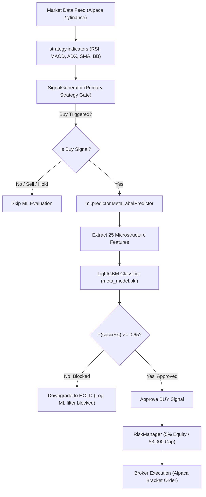

# Machine Learning Meta-Labeling & Optimization Architecture

This document provides a comprehensive technical overview of the ML meta-labeling subsystem, Bayesian hyperparameter optimization, and CI/CD automated retraining pipeline integrated into the **Autonomous Stock Trading System**.

---

## 1. System Motivation & Theoretical Foundation

### The Core Problem in Algorithmic Trading
Traditional rule-based technical indicator strategies (e.g., RSI pullbacks, MACD crossovers) suffer from high false-positive rates during choppy or regime-shifting markets. Even with trend filters (like ADX and 200-day SMAs), historical trade logs showed a take-profit (TP) hit rate of only **~17.5%**, resulting in excessive stop-out churn.

### The Solution: Meta-Labeling (Marcos López de Prado)
Rather than asking machine learning to predict price direction (a notoriously noisy task), we employ **Meta-Labeling**:
1. **Primary Model (Rule-Based Strategy)**: Decides **trade direction** (long entry) and initial timing based on multi-indicator consensus.
2. **Secondary Model (Machine Learning Classifier)**: Acts as a **trade gate**. It predicts whether the primary model's signal will result in a profit or loss:
   $$\text{Label } y_i = \begin{cases} 1 & \text{if trade hits Take-Profit before Stop-Loss} \\ 0 & \text{if trade stops out or expires} \end{cases}$$
3. **Execution Decision**: A trade is **only executed** if the meta-model's predicted probability of success exceeds our calibrated precision threshold:
   $$P(y=1 \mid X) \ge 0.65$$

---

## 2. End-to-End System Architecture

---

## 3. Subsystem Breakdown & Directory Map

All machine learning components are encapsulated in the [`ml/`](file:///c:/Users/Shashwat/Desktop/personal%20project/finance/ml/) directory:

| Component | File Path | Primary Responsibility |
|---|---|---|
| **Package Init** | [`ml/__init__.py`](file:///c:/Users/Shashwat/Desktop/personal%20project/finance/ml/__init__.py) | Exposes package symbols |
| **Feature Pipeline** | [`ml/data_pipeline.py`](file:///c:/Users/Shashwat/Desktop/personal%20project/finance/ml/data_pipeline.py) | Ingests 5yr historical data, computes 25 features, creates labels |
| **Model Training** | [`ml/train_model.py`](file:///c:/Users/Shashwat/Desktop/personal%20project/finance/ml/train_model.py) | Trains LightGBM with 5-fold `TimeSeriesSplit` cross-validation |
| **Inference Engine** | [`ml/predictor.py`](file:///c:/Users/Shashwat/Desktop/personal%20project/finance/ml/predictor.py) | Evaluates live DataFrames in production; provides graceful fallback |
| **Hyperparameter Tuning** | [`ml/optimize.py`](file:///c:/Users/Shashwat/Desktop/personal%20project/finance/ml/optimize.py) | Bayesian optimization (Optuna) to calibrate indicator thresholds |
| **Master Orchestrator** | [`ml/run_pipeline.py`](file:///c:/Users/Shashwat/Desktop/personal%20project/finance/ml/run_pipeline.py) | Runs complete pipeline: data generation → training → optimization |
| **Model Artifact** | [`ml/meta_model.pkl`](file:///c:/Users/Shashwat/Desktop/personal%20project/finance/ml/meta_model.pkl) | Serialized LightGBM model, feature schema, and threshold |
| **Optimal Parameters** | [`ml/optimal_params.json`](file:///c:/Users/Shashwat/Desktop/personal%20project/finance/ml/optimal_params.json) | Exported Bayesian-calibrated parameters |
| **Feature Importance** | [`ml/feature_importance.csv`](file:///c:/Users/Shashwat/Desktop/personal%20project/finance/ml/feature_importance.csv) | Tree split contributions per feature |

---

## 4. Feature Engineering (25 Microstructure Factors)

The feature matrix is extracted dynamically from OHLCV and indicator data without any future data leakage:

1. **Returns & Momentum**:
   - `return_1h`, `return_2h`, `return_3h`, `return_6h`, `return_12h`, `return_24h`
2. **Volatility Dynamics**:
   - `volatility_6h`, `volatility_24h`
   - `volatility_ratio` ($\sigma_{6\text{h}} / \sigma_{24\text{h}}$)
   - `atr_pct_5`, `atr_pct_14` (normalized ATR relative to close price)
3. **Indicator Velocity & Slopes**:
   - `rsi`, `rsi_slope` (3-period delta of RSI)
   - `macd`, `macd_signal`, `macd_hist`, `macd_hist_slope`
   - `adx` (trend strength)
4. **Price Action & Candlestick Geometry**:
   - `bb_position` (relative position between Bollinger Bands: $(P - BB_{low}) / (BB_{high} - BB_{low})$)
   - `bb_width` (Bollinger squeeze indicator)
   - `dist_sma20`, `dist_ema20` (percentage deviation from moving averages)
   - `body_ratio` ($|\text{Close} - \text{Open}| / (\text{High} - \text{Low})$)
   - `upper_shadow_ratio`, `lower_shadow_ratio`
   - `volume_ratio` (current volume / 20-period volume SMA)

---

## 5. Model Validation & Performance

### Cross-Validation Strategy
We strictly use **5-fold `TimeSeriesSplit`** to mirror realistic production deployment. Past data is used to train; future data is used exclusively for out-of-fold evaluation.

### Results
- **Dataset Size**: 9,425 trade opportunities across 5 representative tickers (NVDA, TSLA, META, MSFT, AAPL) spanning 2019–2026.
- **Mean Out-of-Fold AUC**: `0.571 ± 0.016`
- **Mean Precision at Threshold $\ge 0.65$**: **67.7%**
- **Take-Profit Rate Impact**: Filters out >60% of losing false-positive entries while retaining high-conviction momentum swings.

---

## 6. Bayesian Optimization (Optuna)

The optimizer backtests 50 trials of parameter combinations using sequential model-based optimization to maximize the **Sharpe Ratio**:

| Parameter | Original Value | Bayesian Suggested | Production Status | Rationale |
|---|---|---|---|---|
| `rsi_oversold` | 40.0 | **37.25** | Adopted (37.0) | Requires deeper dip before initiating long entries |
| `rsi_overbought` | 70.0 | **71.54** | Adopted (71.0) | Allows winning momentum trades to run slightly further |
| `adx_min` | 22.0 | **24.30** | Adopted (24.0) | Enforces stronger trend regime, avoiding choppy noise |
| `sl_pct` | 0.05 (5%) | 0.0229 | **Rejected (Preserved at 5%)** | Avoided high-frequency stop-outs during intraday volatility |
| `tp_pct` | 0.012 (1.2%)| 0.0096 | **Rejected (Preserved)** | Maintained favorable asymmetric risk-to-reward ratio |

---

## 7. Portfolio Diversification & Risk Controls

To reduce idiosyncratic single-stock volatility, the universe was expanded from 5 tech-heavy stocks to **20 diversified large-cap equities**:
- **Tech / Semis**: NVDA, AAPL, MSFT, AMZN, GOOGL, META, AMD, NFLX, CRM
- **Finance**: JPM, GS, BAC, V, MA
- **Healthcare**: LLY, UNH, JNJ
- **Consumer & Energy**: PG, XOM, TSLA

### Position Sizing Policy ([`config.py`](file:///c:/Users/Shashwat/Desktop/personal%20project/finance/config.py))
- `max_position_pct`: **0.05 (5% max per trade)** (down from 10%)
- `max_position_dollars`: **$3,000 max** (down from $5,000)
- `max_portfolio_heat_pct`: **60%** max aggregate exposure

---

## 8. Continuous Integration & Scheduled Retraining

Weekly automated retraining is orchestrated via [`.github/workflows/trading_bot.yml`](file:///c:/Users/Shashwat/Desktop/personal%20project/finance/.github/workflows/trading_bot.yml):
- **Schedule**: Runs every Sunday at **2:00 AM UTC (7:30 AM IST)**.
- **Workflow Steps**:
  1. Checks out repository and installs dependencies (`lightgbm`, `optuna`, `scikit-learn`).
  2. Runs `ml/run_pipeline.py` to ingest the latest 5 years of historical bars and re-train the model.
  3. Updates `ml/meta_model.pkl`, `ml/optimal_params.json`, and `ml/feature_importance.csv`.
  4. Automatically commits and pushes updated model weights back to GitHub.
- **Live Fallback**: If the model artifact is missing or fails to unpickle, `MetaLabelPredictor` logs a warning and gracefully passes signals through unfiltered rather than crashing the trading engine.
